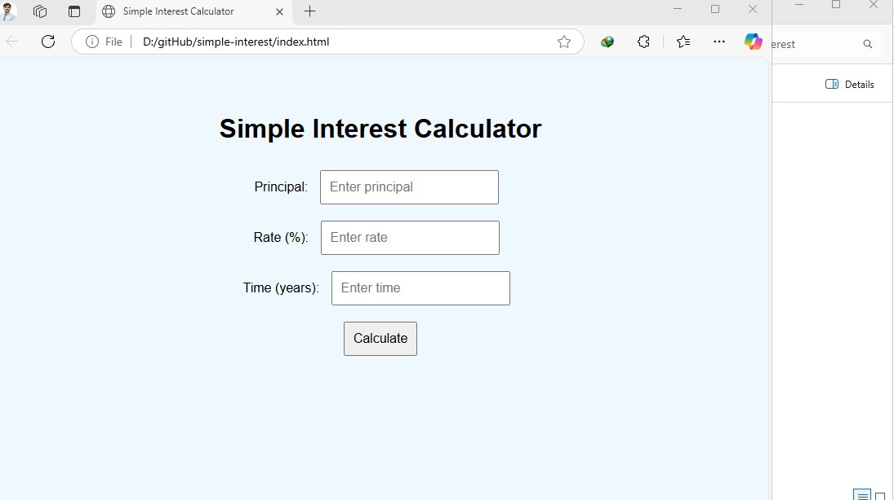

# Simple Interest Calculator

This is a simple web-based calculator that computes the simple interest based on user inputs.

## How to Use
1. Enter the principal amount.
2. Enter the rate of interest.
3. Enter the time (in years).
4. Click "Calculate" to see the result.

## Technologies Used
- HTML
- CSS
- JavaScript

## License
This project is licensed under the Apache 2.0 License.

## Screenshot

